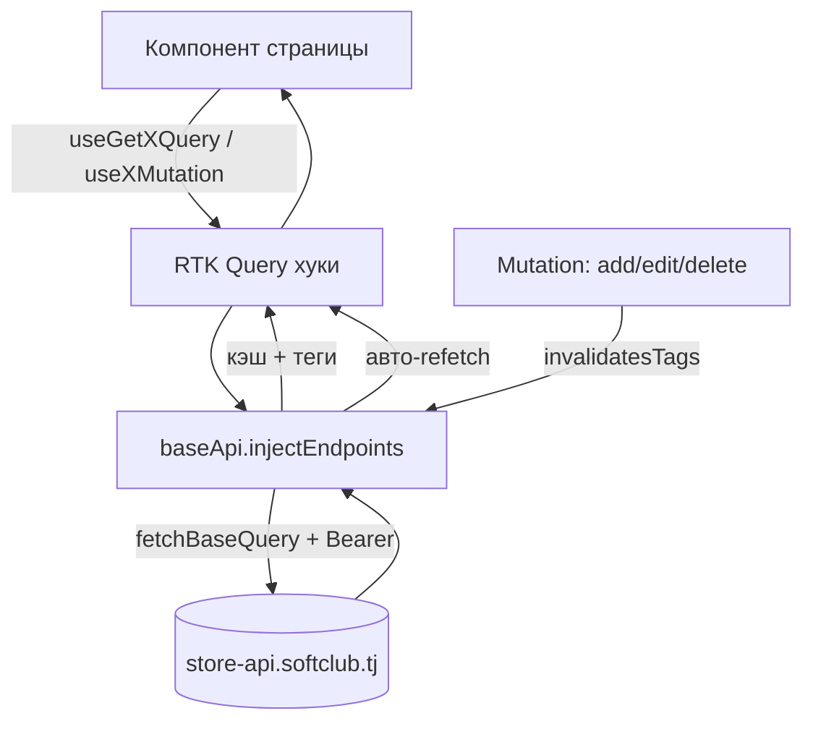
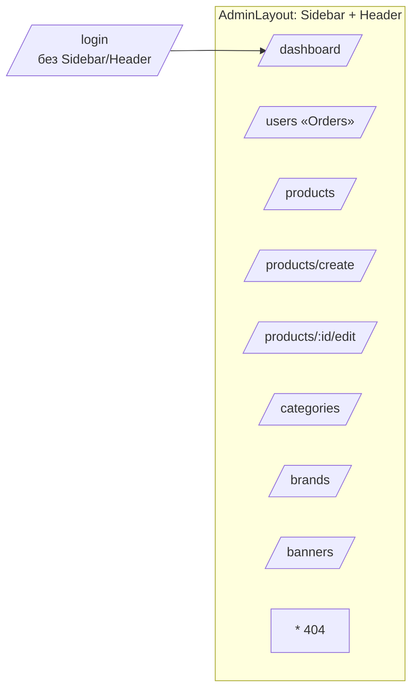

# 01 — Архитектура (FSD)

Feature-Sliced Design. Импорты строго сверху вниз.

```
app → pages → widgets → features → entities → shared
```

| Слой | Что | Импортирует |
|---|---|---|
| `app` | store, провайдеры, роутер, layout | всё ниже |
| `pages` | страницы-роуты (папка на страницу) | widgets, features, entities, shared |
| `widgets` | Sidebar, Header, крупные блоки | features, entities, shared |
| `features` | действия (auth, theme-toggle, lang-switcher, bulk-select) | entities, shared |
| `entities` | строки/карточки сущностей (UserRow, ProductRow, CategoryCard, BrandRow) | shared |
| `shared` | api (RTK Query), ui (shadcn), lib, hooks, config, types | ничего из проекта |

## Диаграмма потока данных (RTK Query)



## Карта роутов



## Структура страницы

```
pages/users/
├── index.tsx            # только композиция
├── components/          # UsersTable, UserFormModal, UsersToolbar
├── hooks/               # useUsersPage (фильтры, выбор, пагинация)
└── types.ts
```

## Naming
- папки `kebab-case`; компоненты `PascalCase.tsx`; хуки `useCamelCase.ts`; api-слайсы `xApi.ts`.
- импорты только через `@/`; наружу — через `index.ts` сегмента.
